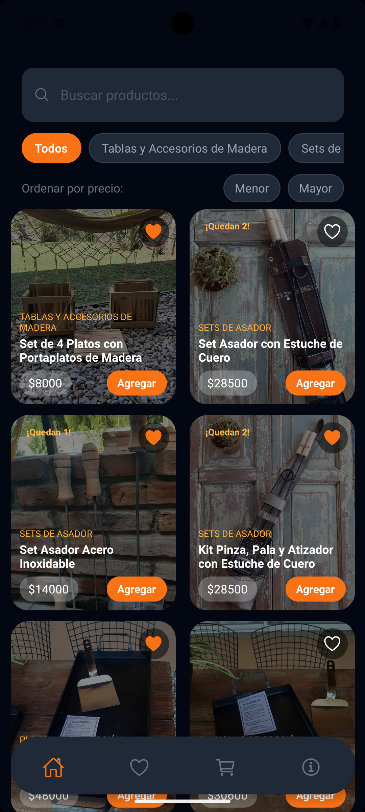
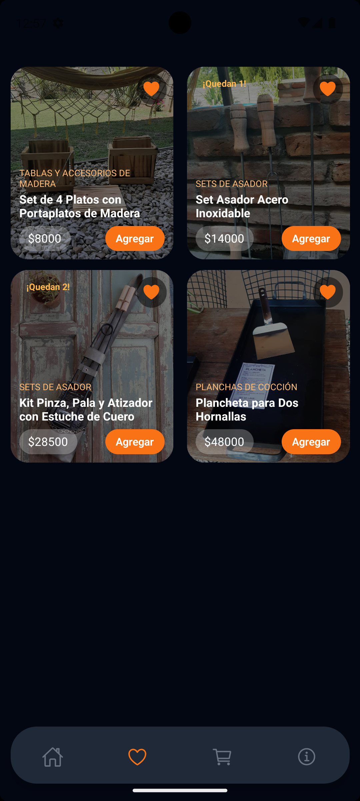
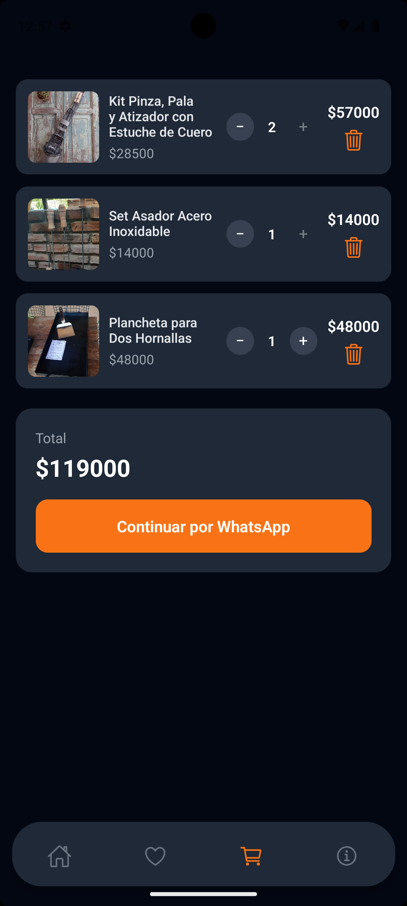
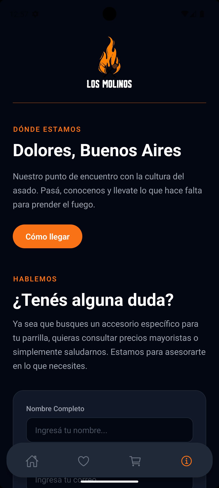

# Los Molinos Regionales - Mobile App 📱

Aplicación móvil nativa diseñada para la digitalización, gestión y comercialización de un catálogo de productos regionales. Este desarrollo forma parte de un ecosistema digital integrado...

---

## 🎯 Demostración Visual

> 💡 **Nota:** Interfaz principal de la aplicación.

| Catálogo de Productos | Mis Favoritos |
| :---: | :---: |
|  |  |
| **Carrito de Compras** | **Info y Contacto** |
|  |  |

---

## Características Clave (Features)

### 🔍 Búsqueda y Filtrado Táctil
Barra de búsqueda optimizada y filtros dinámicos diseñados específicamente para interacciones fluidas en pantallas móviles.
<div align="center">
  
</div>

### ❤️ Gestión de Favoritos
Sistema para que los usuarios puedan guardar sus productos preferidos para futuras compras, mejorando la retención.
<div align="center">
  
</div>

### 🛒 Control de Stock y Conversión (Deep Linking)
Lógica integrada con Firestore que limita la cantidad según el stock real. Al finalizar, utiliza un intent nativo (`whatsapp://send`) para agilizar el proceso de checkout.
<div align="center">
  
</div>

### 📍 About & Contacto
Sección institucional con la ubicación física del local (mediante intent a Google Maps) y formulario de contacto directo integrado con **Formspree** para la gestión ágil de correos electrónicos.
<div align="center">
  
</div>

---

## 🛠️ Stack Tecnológico

* **Core:** React Native (Expo Framework)
* **Lenguaje:** TypeScript (Tipado estricto para garantizar robustez y escalabilidad)
* **Base de Datos:** Firebase Firestore (NoSQL, Tiempo Real)
* **Entorno de Previsualización y Ajustes:** Android Studio (Virtualización nativa en AVD Pixel 7 - Android API)

---

## 🧠 Decisiones de Arquitectura y UX Móvil

Como estudiante de Análisis de Sistemas, el desarrollo se abordó desde una perspectiva de producto integral, evitando tratar la app móvil como una simple copia "responsive" de la web:

1.  **Arquitectura de Datos Unificada:** Se conectó la aplicación al mismo backend NoSQL de la SPA web actual. Esto valida un modelo de arquitectura escalable donde múltiples clientes consumen una única fuente de verdad (Single Source of Truth).
2.  **Optimización de Interfaz Móvil:** Se eliminaron conscientemente elementos de fricción web, como banners tipo "Hero" innecesarios en pantallas pequeñas y mapas embebidos pesados, reemplazando estos últimos por llamadas nativas al sistema operativo que abren directamente la app de Google Maps externa mediante intents.
3.  **Código Seguro con TypeScript:** La migración y desarrollo bajo interfaces y tipos definidos redujo los errores en tiempo de ejecución, asegurando que el flujo de datos desde Firestore sea consistente en todo el árbol de componentes.

---

## 🚀 Instalación y Configuración Inicial

Si deseas ejecutar el proyecto localmente en tu entorno de desarrollo:

**1. Clonar el repositorio:**
```bash
git clone https://github.com/antoninojoaquin/los-molinos-regionales-mobile.git
cd los-molinos-regionales-mobile
```

**2. Instalar dependencias:**
```bash
npm install
```

**3. Iniciar el servidor de Expo:**
```bash
npx expo start
```

**4. Para previsualizar en emulador:**
*(Requiere Android Studio configurado con AVD)*
* Presioná la tecla `a` en la terminal para abrir la app en el emulador de Android.
